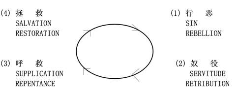

# 恶性循环之祸根 

> 日期：第11周 第3天

> 经文：士一至五章

当以色列人进驻迦南后，因有些地方尚未征服，所以战争仍持续。犹大及西缅虽征服了迦南人，取得耶路撒冷，表面看来是很成功，然而他们在几方面都没有遵行神的旨意，所以种下了严重的祸根：

1. 没有赶出迦南人 (参一19、21、28-31、33)，以致迦南人成了以色列人“肋下的荆棘，“他们的神，必作你们的纲罗”。(二3)
2. 事奉诸巴力，行耶和华眼中看为恶的事。(二11)
3. 与异教徒通婚 (三6)

以色列人离弃神，以致在士师期间，下列恶性循环经常出现：

从三至十六章，上述恶性循环至少七度出现。第一循环是三章一至十一节，神兴起俄陀聂解救以色列人；第二循环是三章二十一至三十一节，神兴起以笏成为以色列人的解救；第三循环是四章一节至五章二十一节，神兴起底波拉及巴拉解救以色列人出困境。

<table> 
 <tbody>
  <tr> 
   <th>
第一、二章
</th> 
   <th colspan="3">
第三章
</th> 
   <th>
第四、五章
</th> 
  </tr> 
  <tr> 
   <td>
背景
</td> 
   <td>
俄陀聂
 
1-11
</td> 
   <td>
以笏
 
12-30
</td> 
   <td>
珊迦
 
31
</td> 
   <td>
底波拉、
 
把拉
</td> 
  </tr> 
  <tr> 
   <td>
祸根
</td> 
   <td colspan="3">
神的使者
</td> 
   <td>
神的神迹
</td> 
  </tr> 
 </tbody>
</table>

**默想**

在摩西带领以色列人的时代，他曾严厉吩咐以色列人要谨守三诫 (申七1-5) ：(1)灭绝赶出所有迦南地的居民 (2)不可与他们通婚 (3)远离偶像。结果他们有遵守吗？(参一27-36，二11-13，三5-7)

**与主同行**

“没有赶出”迦南人，是以色列人关键性的错误，造成日后祸患无穷。同样，你有“全然赶出”自己的坏习惯、淫念、不造就人的论断、罪的环境等吗？小心，若不赶出这些罪恶，会叫你后患无穷的！

**金句**

申命记十二章二节

