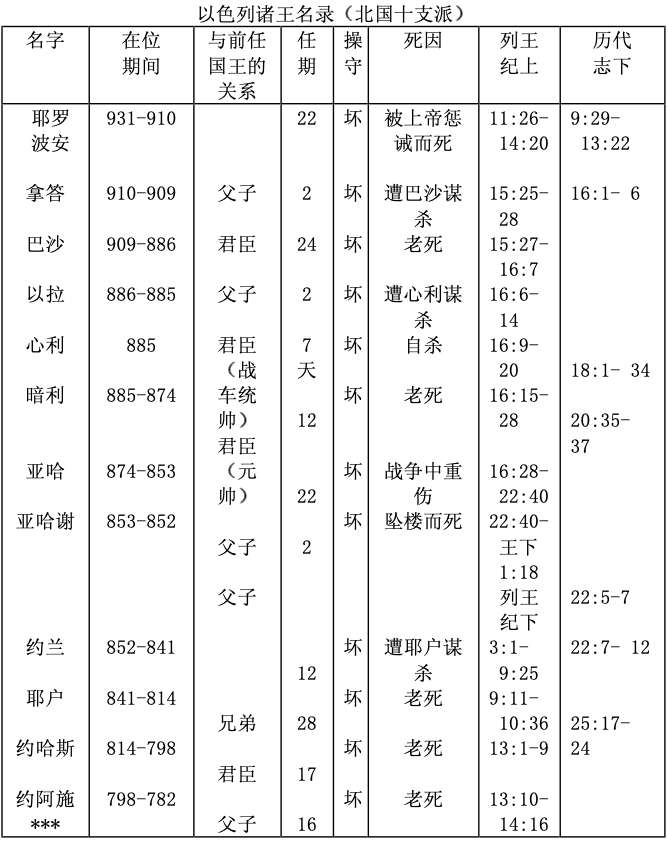
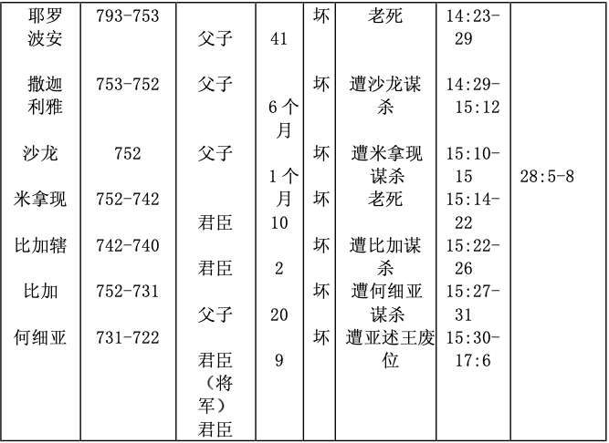
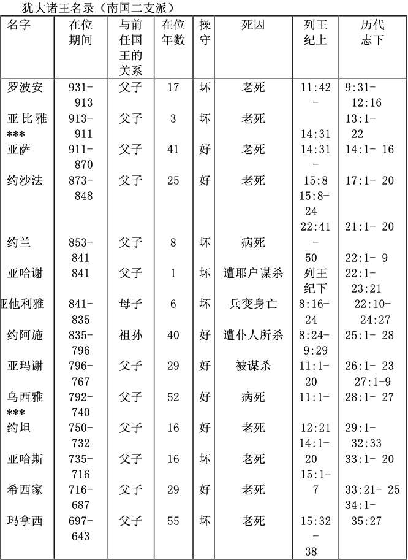
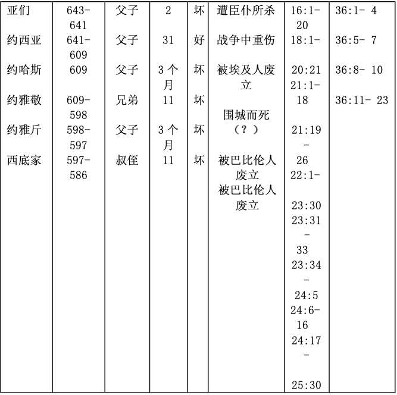

# 两国对敌 

> 日期：第15周 第3天

> 经文：王上十二至十六章

所罗门的财富一部分来自高税额。他去世后，儿子罗波安继承王位，一些老臣子建议减税及劳役，使人民生活宽裕一点，但罗波安不听，反采纳那些与他一同长大之少年人的愚蠢建议，加增税额，使人民负担更重，并以严刑统治，卒造成以色列人的反弹及叛变，并立耶罗波安作他们的王，从此以色列分成二国。因百姓不能再去耶城朝拜，耶罗波安竟在伯特利及但造二金牛犊，陷民于罪。神遣仆人去警告他，任何人，包括先知，不遵守神命令的人必受审判。先知后来见噬于狮，就是因不听神的话。可惜耶罗波安死性不改，甚至先知亚希雅预言他家将要发生的灾祸，耶罗波安仍没有改变，终于他要把国家拱手让给人。罗波安死后，亚比央（恶）及亚撒（善）接续作王。而拿答及巴沙则先后继任耶罗波安，但均是恶的，两国内战频频。北国政局更是不稳，谋朝篡位的现象常出现（见附录）。心利乃首开此例者，结果被伐，自焚而死。至暗利、亚哈，拜偶像、道德败坏的情况更加厉害，所以耶和华对以色列震怒更大。

<table>
 <tbody>
  <tr>
   <th>
第十二章
</th>
   <th>
第十三章
</th>
   <th>
第十四章
</th>
   <th>
第十五章
</th>
   <th>
第十六章
</th>
  </tr>
  <tr>
   <td>
罗波安冥顽
</td>
   <td>
耶罗波安拜偶像
</td>
   <td>
耶罗波安重病
</td>
   <td>
内战
</td>
   <td>
内乱
</td>
  </tr>
  <tr>
   <td>
分裂
</td>
   <td>
亵渎
</td>
   <td>
病灾
</td>
   <td>
兵灾
</td>
   <td>
篡位夺权
</td>
  </tr>
 </tbody>
</table>

**默想**

南北二国之比较（参马有藻，《旧约概论》修订版，中国信徒布道会， 1991，第106页）

<table>
 <tbody>
  <tr>
   <td>
<b>&nbsp;南国&nbsp;&nbsp;</b>
</td>
   <td>
<b>&nbsp;北国&nbsp;&nbsp;</b>
</td>
  </tr>
  <tr>
   <td>
1.二支派（犹大、便雅悯）支持
</td>
   <td>
十支派支持
</td>
  </tr>
  <tr>
   <td>
2.建都耶路撒冷
</td>
   <td>
建都撒玛利亚
</td>
  </tr>
  <tr>
   <td>
3.人数稀少（一倍）
</td>
   <td>
人数众多（三倍）
</td>
  </tr>
  <tr>
   <td>
4.地土较瘠（一倍）
</td>
   <td>
地大物博（五倍）
</td>
  </tr>
  <tr>
   <td>
5.圣殿所在
</td>
   <td>
金牛城（但与伯特利）
</td>
  </tr>
  <tr>
   <td>
6.始终一朝（大卫王朝）
</td>
   <td>
历九朝
</td>
  </tr>
  <tr>
   <td>
7.历时445年（主前931-586）
</td>
   <td>
历时&nbsp;&nbsp;210年（主前931-722）
</td>
  </tr>
  <tr>
   <td>
8.二十王（十九王，一后）
</td>
   <td>
二十王
</td>
  </tr>
  <tr>
   <td>
9.毁誉参半（八善十二恶，善恶混杂）
</td>
   <td>
全行神眼中看为恶的事
</td>
  </tr>
  <tr>
   <td>
10.多先知辅助，利未人全支持
</td>
   <td>
比较少先知，无利未人支持
</td>
  </tr>
  <tr>
   <td>
11.神与大卫立永约
</td>
   <td>
无
</td>
  </tr>
  <tr>
   <td>
12.亡于巴比伦（主前586）
</td>
   <td>
亡于亚述（主前&nbsp;&nbsp;722）
</td>
  </tr>
  <tr>
   <td>
13.灭后归回，仍属血统纯正
</td>
   <td>
无归回，已混杂
</td>
  </tr>
 </tbody>
</table>

**与主同行**

要得人心，我们本身必先有爱心，罗波安失人心，是因他考虑自己的享受比百姓的幸福更重要。我们又如何？是否考虑自己的面子、享受、自由权利比家人的需要更重要、比教会弟兄姊妹的需要更重要？大卫下属为什么冒死取水给他喝（撒下二十三 13-17）？（参撒上二十二1-2等）其实你也可以成为人见人爱的人！

**金句**

箴言十六章二十五节

**附录**

以色列及犹大诸王名录

（取自《读经日程》四月五日，大光书房， 1990）

注 :*约兰、**约阿施、***亚比雅、****乌西雅等王统治时期有重叠之处。

