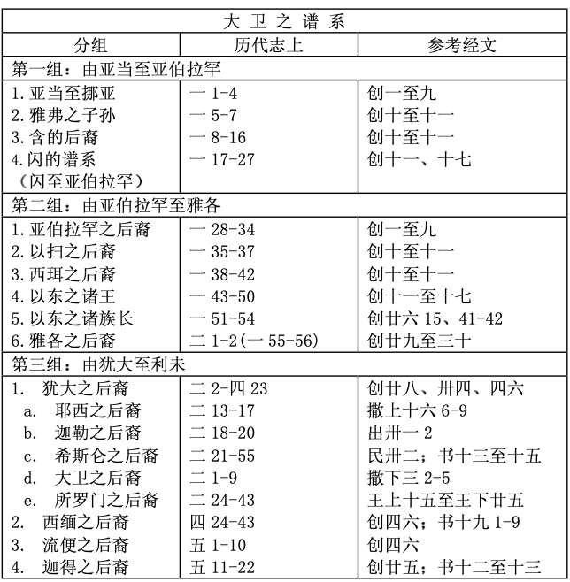
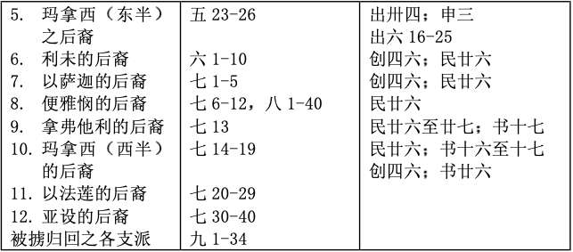

# 大卫与以色列的家谱 

> 日期：第16周 第6、7天

> 经文：代上一至九章

历代志不仅是撒母耳记与列王记的政治历史，它更从祭司的角度去观察神的子民。历代志上分为两段，首段（一至九章）为大卫及以色列家之族谱，次段则集中在大卫王朝之上（十至二十九章）。

首段之族谱不厌其烦地详论大卫之家谱，指出他的“血统”始自人类始祖亚当，其“道统”始自亚伯拉罕（1章下）。第九章则记载在回归时期，返耶路撒冷在圣殿中服事之利未支派之族谱。犹大支派乃王族，乃选民中之选民；利未支派为祭司族，是选民中之圣民。

**默想**

历代志下是希伯来文圣经中最后的一卷书，所以主基督在路加福音十五章五十一节提到的殉道者是从亚伯到撒迦利亚，其实就是从第一个殉道者（创四 8）到最后一个殉道者（代下二十四21）的意思。

**与主同行**

这九章圣经看来十分沉闷，读下去很容易使人昏昏欲睡。但圣经所载皆有意义，对犹太人而言，它建立了大卫王朝之一脉相承及合法性。对我们而言，可曾想过你是王族，要与主一同作王（启二十一 6，二十二5）、作祭司（彼前二9）？你会怎样珍惜及活出这身分？

**金句**

彼得前书二章九节

