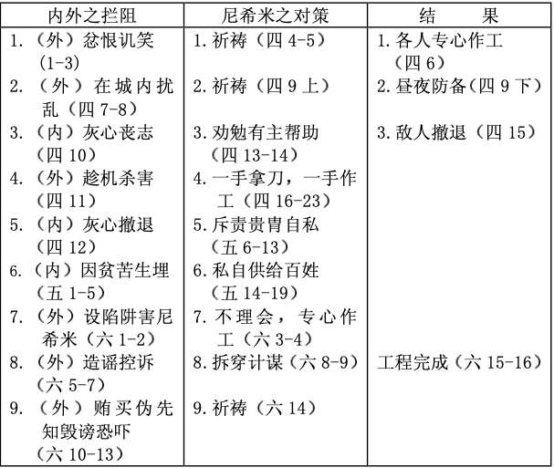

# 城墙重建完工 

> 日期：第20周 第1天

> 经文：尼三至六章

重建耶路撒冷城墙的工作可谓困难重重，外有撒玛利亚人参巴拉、亚扪人多比雅、阿拉伯人基善及同党诸多阻拦，甚至不惜设陷阱、利诱、欺骗和暗杀阴谋。内有犹太人灰心、意志不坚定，再加上作官长之同胞自私、压榨、欺凌的行为，令人民怨声载道……然而，尼希米凭坚毅不屈之信心与斗志，将这些困难一一克服。这些过程表列于下：（取材自马有藻，《旧约概论》修订版，中国信徒布道会，1991，页149）

再加上精细之分工、充分之准备、多方面鼓励士气，工程终在52天内大功告成。这是历史上最有效之工程之一。

<table>
 <tbody>
  <tr>
   <th>
第三章
</th>
   <th>
第四章
</th>
   <th>
第五章
</th>
   <th>
第六章
</th>
  </tr>
  <tr>
   <td>
分工合作
</td>
   <td>
外忧：敌人搁阻
</td>
   <td>
内患：官长压迫
</td>
   <td>
城墙完工
</td>
  </tr>
  <tr>
   <td>
善于委任人
</td>
   <td>
以祷告决心退敌
</td>
   <td>
以身作则、教训
</td>
   <td>
胜&nbsp;&nbsp;&nbsp;&nbsp;&nbsp;&nbsp;&nbsp; 利
</td>
  </tr>
 </tbody>
</table>

**默想**

敌人诡计多端，听起来好象是为我们设想，其实是陷阱。示玛雅的诡计是什么？他告诉尼希米敌人要杀他，所以倒不如在殿中会面，将殿门关锁。对于这建议，一般人可能很难作决定，但尼希米是熟读圣经的人，他知道圣殿不是给人逃命的，普通人是不可随便进殿（参民十八 7），可能他记得乌西雅王进殿后之遭遇（参代下二十六16-20），所以没有中计。弟兄姊妹，熟习神的话，是揭穿敌人诡计之最重要武器。

**与主同行**

你试过被人嘲讽、取笑、侮辱吗？你当时的反应怎样？暴跳如雷？浪费时间去反驳、辩护、纠缠下去？报复？还是象尼希米一样，继续小心言行，使灯发亮，又将问题交给神？主安慰我们说“人若因我辱骂你们、逼迫你们、捏造各样坏话毁谤你们，你们就有福了，应当欢喜快乐，因为你们在天上的赏赐是大的！”（太五 11-22上）

**金句**

尼希米记五章十节

